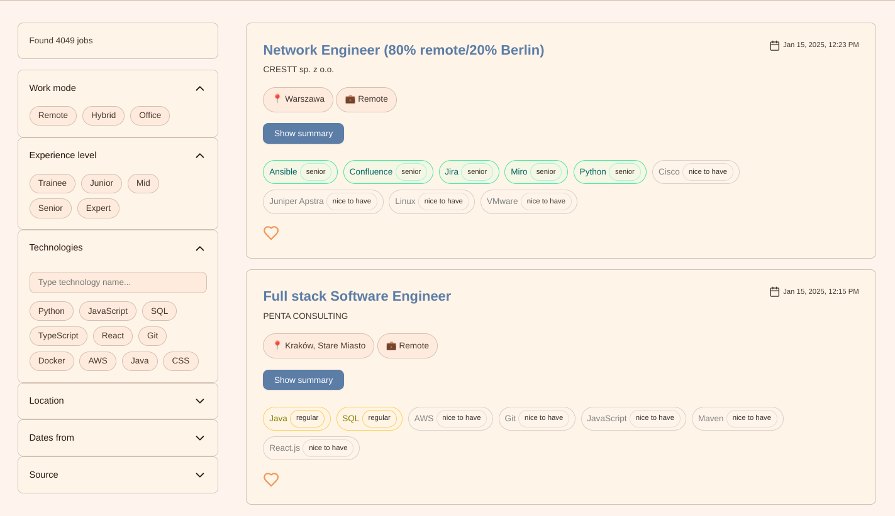
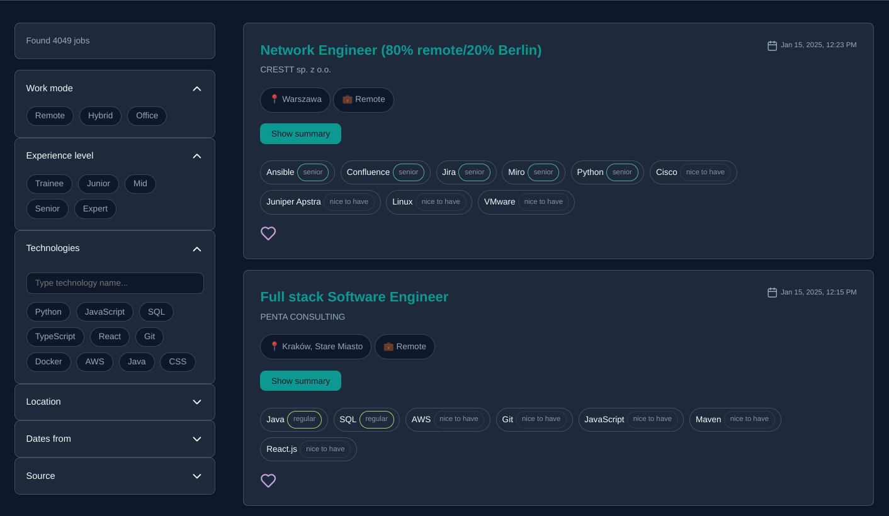
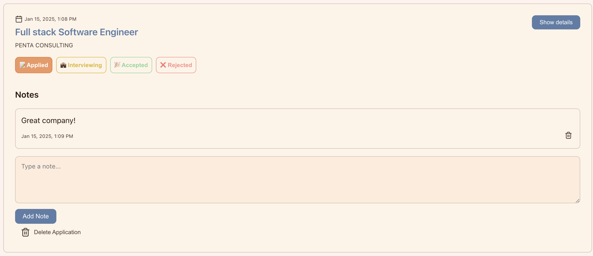
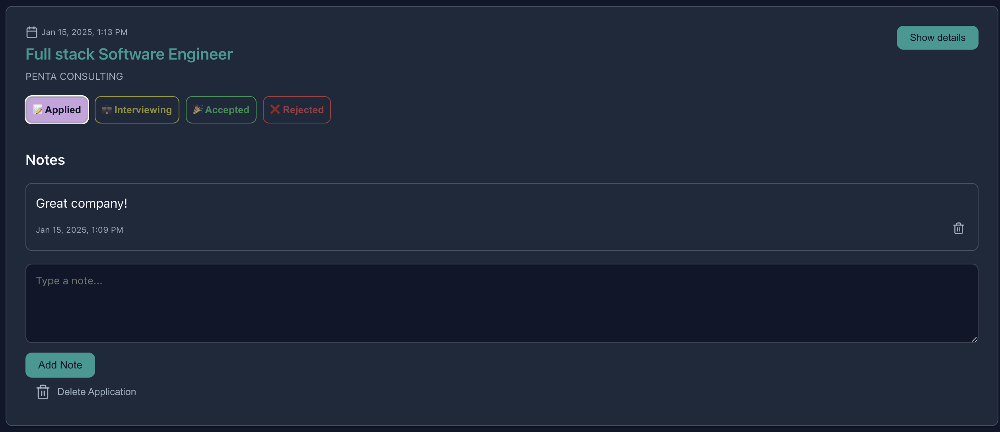
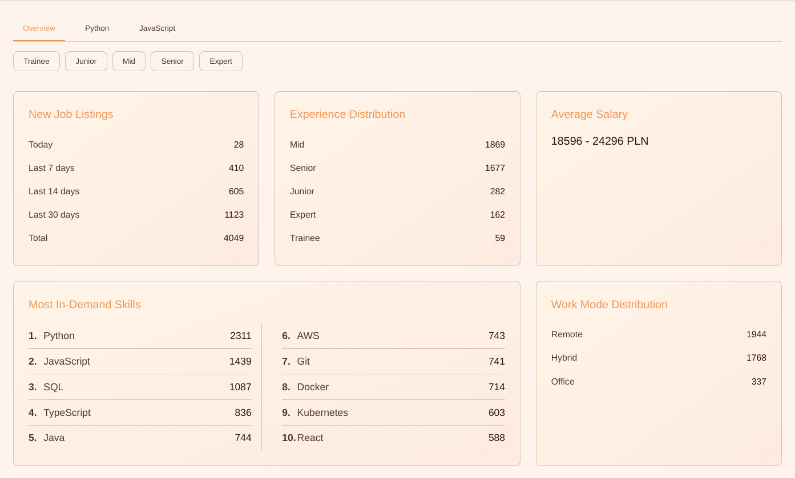
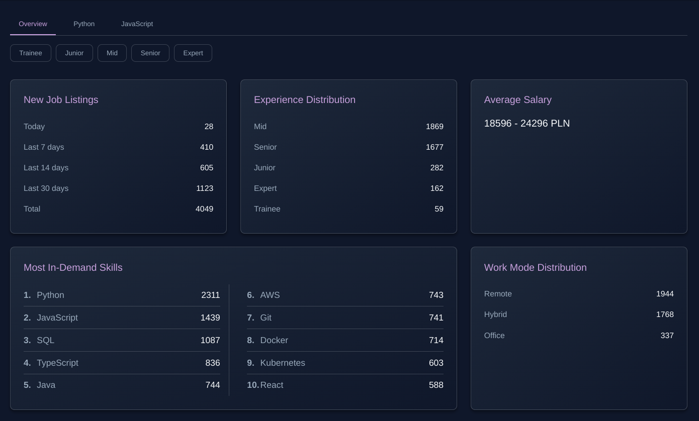

# DevRadar

A centralized platform for IT job seekers in Poland, aggregating listings from multiple job boards.

Live: [https://devradar.work](https://devradar.work)

## 🚀 Features

- 🔍 Real-time job aggregation from major Polish job boards:
  - Pracuj.pl
  - NoFluffJobs
  - JustJoinIT
  - TheProtocol
- 📊 Interactive market statistics dashboard
- 🤖 AI-powered job description summarization using ChatGPT
- 👤 Personal job application tracking system
- 🌐 Bilingual interface (Polish/English)
- 🎯 Advanced filtering system
- 🌙 Light/Dark theme
- 📱 Responsive design
- ⚡ Optimized performance through React, Redis caching, and database indexing

## 🎯 Overview

DevRadar helps IT job seekers save time by:

- Providing quick access to key job details (skills, location, salary, work mode) without extra clicks
- Offering AI-powered summaries of job descriptions
- Enabling easy application tracking with notes and status updates
- Maintaining historical job market data for trends analysis





### Application Tracking

Track your job applications with status updates, notes, and automatic date management.






### Interactive Dashboard





## Techstack

### Backend
- 🐍 Django + 🛡️ Django Ninja (REST API)
- 📄 BeautifulSoup4 (Web scraping)
- ⏰ Celery (Periodic task execution for web scraping)
- 🤖 ChatGPT API (Summarizing descriptions)

#### Database
- 🐘 PostgreSQL
- 🗄️ Redis (Caching and Celery broker)

#### DevOps
- 🐳 Docker (Containerization)
- 🌐 Hetzner (VPS)
- 📡 Nginx (Reverse proxy)

### Frontend
- ⚡ Vite + ⚛️ React

## Distinctiveness and Complexity

This project stands out for several key reasons:

1. **Advanced Web Scraping System**
   - Implements a robust scraping architecture with base and specialized scrapers
   - Handles multiple data sources with different structures
   - Includes automatic rate limiting and error handling
   - Uses BeautifulSoup4 for parsing with specialized selectors for each source

2. **Sophisticated Data Processing**
   - Implements salary standardization across different formats
   - Uses AI (ChatGPT) for intelligent job description summarization
   - Maintains data history while preventing duplicate entries
   - Features complex filtering and search capabilities

3. **Performance Optimizations**
   - Redis caching for frequently accessed data
   - Database indexing for efficient queries
   - Celery for background task processing
   - Docker containerization for scalability

4. **Complex Frontend Architecture**
   - Custom hooks for state management
   - Bilingual support with context-based translations
   - Theme switching capability
   - Responsive design with mobile-first approach

## Directory Structure

### Root (`DevRadar`)
- `docker-compose.prod.yml`: Docker main setup for production
- `docker-compose.yml`: Docker main setup for development

### Backend (`/backend`)

#### Core Files
- `backend/settings.py`: Main Django configuration
- `backend/celery.py`: Celery configuration for background tasks
- `backend/urls.py`: Main URL routing
- `backend/Dockerfile`: Development Dockerfile
- `backend/Dockerfile.prod`: Production Dockerfile

#### Jobs App
- `jobs/api.py`: API endpoints using Django Ninja
- `jobs/models.py`: Database models for jobs and applications
- `jobs/schemas.py`: Schemas used by Django Ninja for API endpoints
- `jobs/summarizer.py`: ChatGPT integration
- `jobs/tasks.py`: Celery task for running Django command
- `jobs/management/commands/run_scrapers.py`: Django command for running scrapers
- `jobs/management/commands/`: Depricated commands, used for cleaning and standardizing data
- `jobs/scrapers/`: Web scraping implementation
  - `base_scraper.py`: Base scraper class
  - `justjoin_scraper.py`: JustJoinIT specific scraper
  - `nofluffjobs.py`: NoFluffJobs specific scraper
  - `pracuj_scraper.py`: Pracuj.pl specific scraper
  - `protocol_scraper.py`: TheProtocol specific scraper
- `jobs/utils/`: Utility functions
  - `salary_standardizer.py`: Salary format standardization
- `jobs/logs/`: Log files


### Frontend (`/frontend`)

- `src/components/`: React components
- `src/hooks/`: Custom React hooks
- `src/styles/`: CSS styles
- `src/contexts/`: React contexts
- `src/config/`: Configuration files
- `Dockerfile`: Development Dockerfile
- `Dockerfile.prod`: Production Dockerfile

## Installation

### Prerequisites
- Docker and Docker Compose
- Git

### Environment Setup

1. Clone the repository:
```bash
git clone https://github.com/Pirat102/DevRadar.git
cd DevRadar
```

2. Set up backend environment:
```bash
cp backend/.env.example backend/.env
```

Edit `backend/.env`

3. Set up frontend environment:
```bash
cp frontend/.env.example frontend/.env
```

### Running the Application

1. Build and start containers:
```bash
docker compose up --build -d
```

2. Create database migrations:
```bash
docker compose exec django python manage.py makemigrations
docker compose exec django python manage.py migrate
```

3. Rebuild containers:
```bash
docker compose up --build -d
```

The application will be available at:
- Frontend: http://localhost:5173
- Backend API: http://localhost:8000
- API Documentation: http://localhost:8000/api/docs
- Flower (Celery monitoring): http://localhost:5555

## Additional Information

### Data Updates
- Job listings are updated every 1 hours via Celery tasks
- Salary data is automatically standardized to monthly PLN format

### Performance
- Redis caching is used for frequently accessed data (filters, statistics)
- Database queries are optimized with appropriate indexes

### Development Notes
- API documentation is available at `/api/docs`
- Celery monitoring is available through Flower interface
- The application uses ChatGPT API for job description summarization
